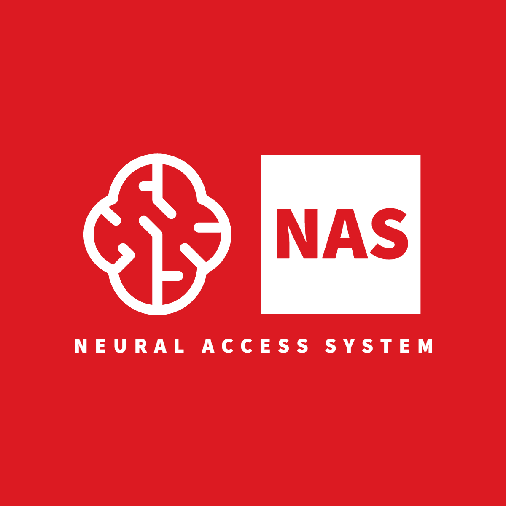

====================
About
====================

The **Neural Access System** was created as a bachelor's thesis that deals with the identification and verification of individuals using `EEG <https://en.wikipedia.org/wiki/Electroencephalography>`_.
Such use of brainwaves would bring a new way to secure and protect sensitive data.
The system is based on the `self face & non self face <https://www.sciencedirect.com/science/article/abs/pii/S0031320312004578>`_ paradigm and is implemented in `Python`.

You can view the entire technical documentation in Slovak `here <https://github.com/RolandZitny/BC-NAS>`_.

.. toctree::
   :maxdepth: 2
